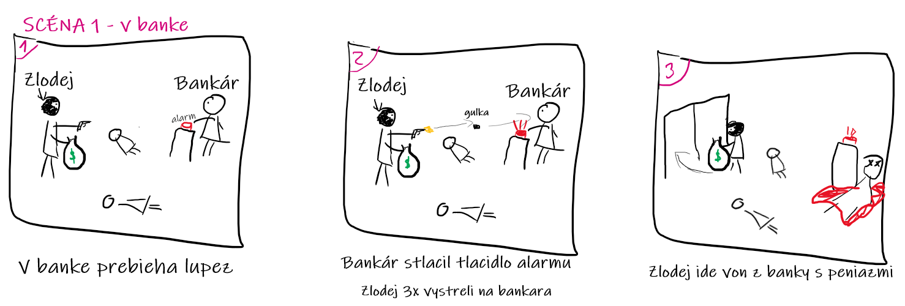
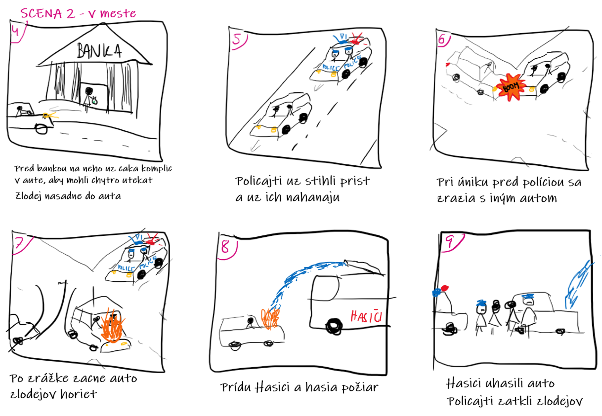

# PPGSO Projekt
Téma: Mesto

Autori:
- Norbert Vígh
- Patrik Velčický

## Návrh projektu
Téma: Mesto

Scéna 1 sa začína v banke, v ktorej prebieha lúpež. Pri odchode zlodeja bankár spustí alarm a zlodej po ňom 3x vystrelí zo zbrane, pričom každá strela má 50% šancu na zásah bankára a ak prvé 2 strely netrafia, tak tretia strela určite trafí. Po týchto 3 výstreloch bankár leží na zemi a krváca. Zlodej odchádza dverami z banky.

Scéna 2 sa odohráva v exteriéri, v meste. Pred bankou ho čaká jeho komplic v aute. Zlodej z banky nastupuje do auta a policajti sú im už v pätách. Začína sa policajná naháňačka po meste. Pri tejto naháňačke sa auto zlodejov na križovatke zrazí s iným autom. Po zrážke auto zlodejov začne horieť. Na miesto sú privolaní hasiči, ktorí hasia oheň. Po uhasení horiaceho auta zlodejov zatknú policajti.

### Grafické efekty v banke
- V banke svietia stropné svetlá
- Cez okná do banky svieti slnko
- Spustený alarm v banke
  - bliká na červeno
- Výstrely zo zbrane
- Letiace gulky na bankára
  - procedurálna animácia - guľka bude mať určenú pravdepodobnosť, s ktorou trafí bankára, pričom bude určený aj maximálny stupeň odchýlky v smere streľby
  - guľky - vznikajúce a zanikajúce objekty
- Bankár krváca po zásahu guľkou
  - krv - časticový systém, vplyv gravitačnej sily

###Grafické efekty pri naháňačke v meste
- Budovy mesta
  - rozmiestnenie jednotlivých budov bude procedurálne generované
- Svietia svetlá na autách
- Svieti slnko
- Blikajú policajné majáky
- Zlodej nasadá do auta so zbraňou a peniazmi
  - hierarchická transformácia objektov
    - 1.úroveň - zlodej v aute
    - 2.úroveň - zlodej drží zbraň a vrece s peniazmi
- Zrážka dvoch aút 
  - Efektívna kolízia medzi objektami
- Simulácia aspoň s dvoma silami s použitím vektorovej algebry
- Oheň na kapote auta lupičov
  - oheň - časticový systém, časticiam bude udelená počiatočná rýchlosť v ľubovoľnom smere vo vodorovnej rovine, bude na nich pôsobiť sila v smere zvislo nahor, ktorá bude spôsobovať že budú stúpať nahor, postupne sa budú častice zmenšovať až po uplynutí náhodne dlhej doby (max do 2s) úplne zmiznú
  - častice vznikajú a zanikajú
- Hasenie požiaru vodou 
  - voda - časticový systém, vplyv dvoch síl - gravitačná sila a vietor
